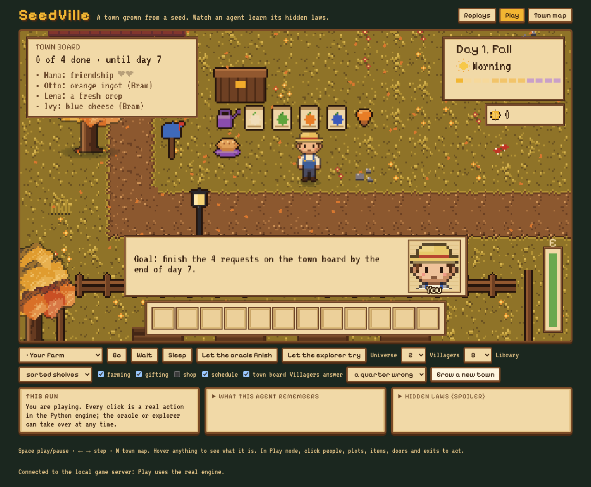
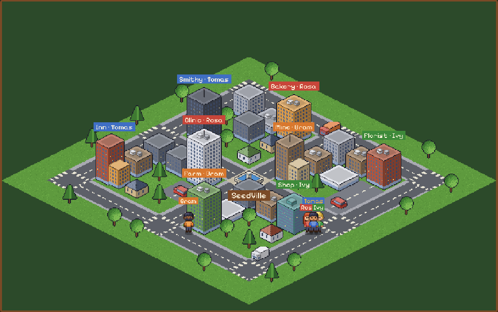
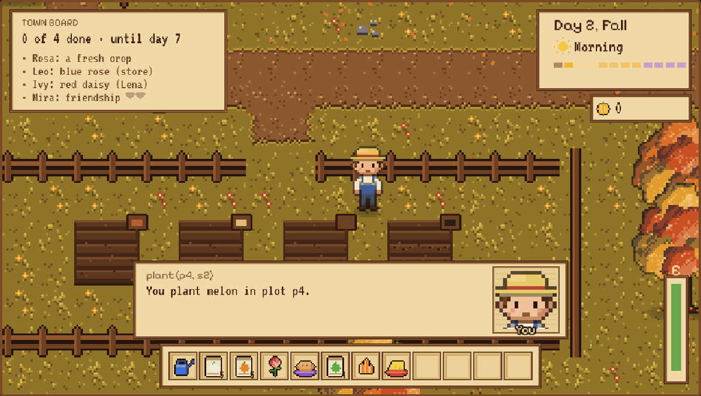
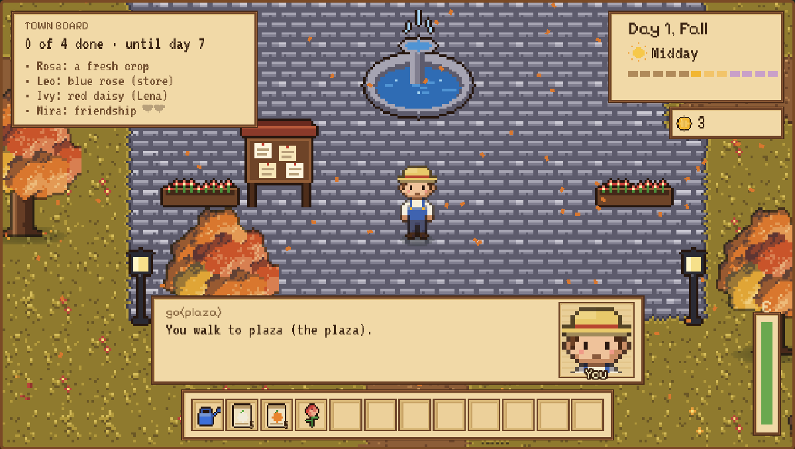
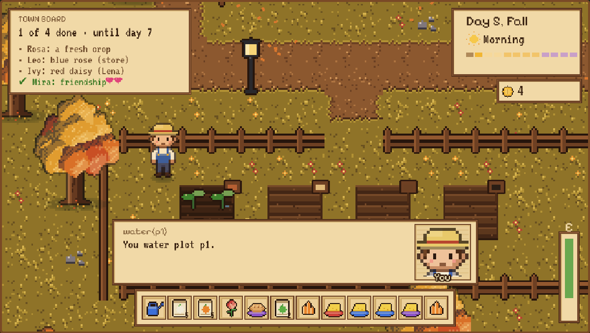
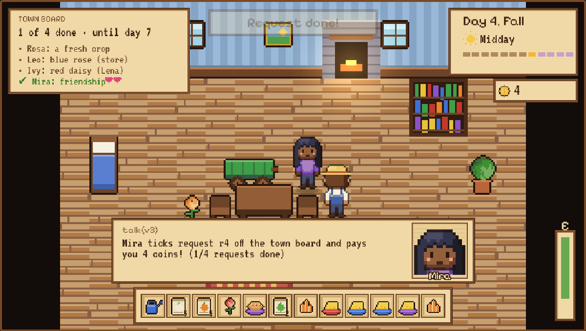
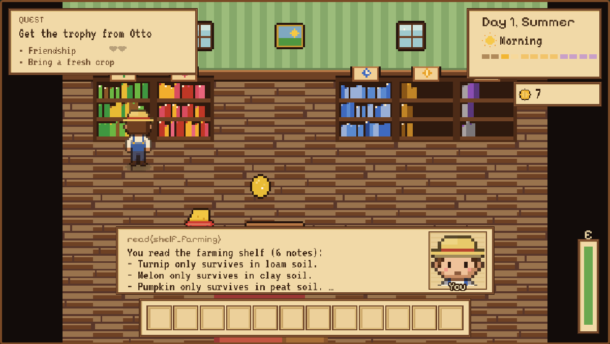
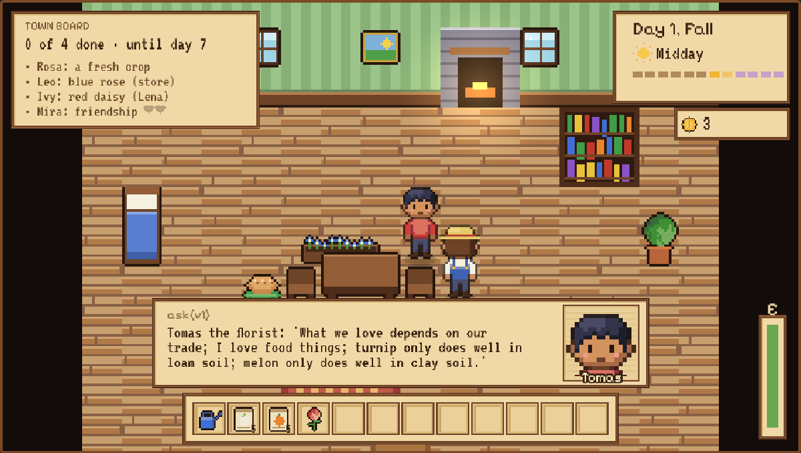
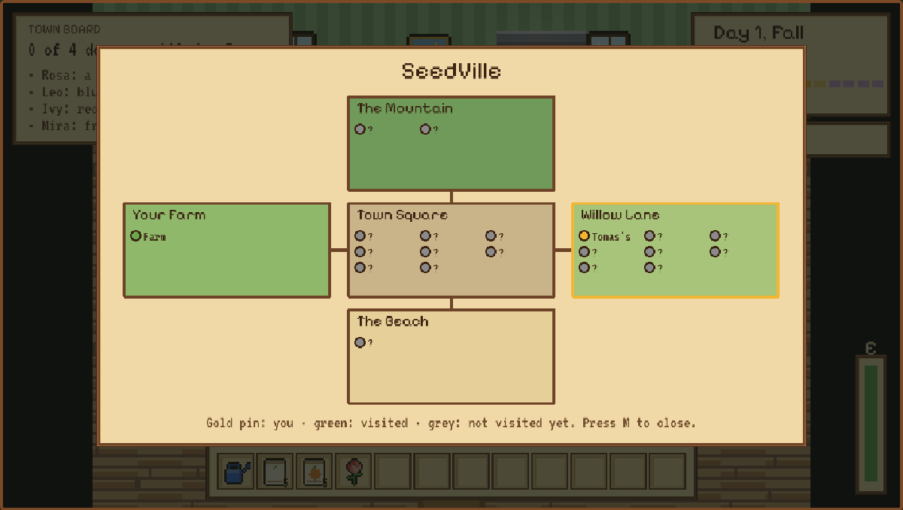

# World Seeds

[English](README.md) | [中文](README.zh-CN.md)



World Seeds is a research environment for agents that **learn how a world works and remember
it**. A world is grown from a compact *seed* that holds hidden laws. The agent explores it,
zooms in on details, acts, and afterwards consolidates what it saw into a learned seed (its own
world model). That seed then helps it in the next world.

```
WorldSeed --grow--> lazy, zoomable, persistent world --zoom / act--> events
    ^                                                                  |
    |              (hidden laws: the agent never reads them)           v
learned seed (world model)  <------------  consolidate (only what the agent perceived)
```

Everything runs on a laptop CPU. LLM agents use the
[OpenAI Agents SDK](https://github.com/openai/openai-agents-python) against any
OpenAI-compatible server; the default is the free model **Qwen3-8B on vLLM**, and ready-made
SLURM scripts run the full study on the Nibi cluster (Compute Canada / Alliance).

## New direction: CodeWorld, networks of developer agents

[docs/codeworld.md](docs/codeworld.md). The goal is an agent network whose collective knowledge exceeds
what one agent can hold, as a base for many agents developing in parallel and across domains. CodeWorld is a
procedurally generated software ecosystem: modules expose functions with public signatures and hidden
behaviour, projects are feature requests that need functions of several modules, developers have notebooks
of limited capacity and learn laws by experiment or by asking teammates. It tests one claim: a network beats
one agent with the same compute exactly when the world is too big for one head, and only if it knows who
knows what. With heuristic developers: at 64 functions and notebooks of 16 laws, a team of 4 routing
questions to module owners finishes 0.96 of its projects, one developer with the team's compute 0.32, and
the same team asking at random 0.27.

```bash
python scripts/run_codeworld.py --out results/codeworld/core && python scripts/analyze_codeworld.py results/codeworld/core
```

The same world as a city you can watch: **SeedVille Workshops** (`web/codeworld.html`) replays recorded
sprints in an isometric town of workshops (modules), machines (functions), masters (owners) and
apprentices walking the roads. In the standard town (48 machines, 12 rules per head, 4 apprentices) masters
deliver every order and one apprentice with the team's time 46%; across three districts (144 machines, 12
apprentices) one head manages 4%.

```bash
python scripts/build_codeworld_web.py && python -m http.server -d web 8000   # http://localhost:8000/codeworld.html
```



## The environments

**SeedVille** is a small Stardew-style town: your farm, a plaza, a general store, eight
villagers with jobs, homes and workplaces, the forest, the mountain and the beach. A clock runs
(12 ticks a day), crops grow overnight, and villagers move around. Each *universe* has its own
hidden laws:

| block | what it adds | hidden law |
|---|---|---|
| farming | plant, water and harvest crops | which soil and which season each crop needs |
| gifting | make friends with liked gifts | gifts are liked by shirt colour, or by the category each job prefers |
| shop | buy what you need with limited coins | (none) |
| schedule | villagers move at midday | where everyone goes at midday |

Universe 0 follows common sense (bakers like food); universes 1 and up are shuffled, so a
language model cannot rely on what it already knows and has to find out.

| env | goal of an episode |
|---|---|
| `town` | get one villager's trophy (they hand it over once their needs are met) |
| `board` | finish a **town board** of four villager requests within a week: bring a fresh crop, become friends, fetch an item another villager keeps, buy something with earned coins |
| `dungeon` | a tighter control world: rooms, doors, keys, jars, switches, machines and boulders |

Memory can also live *in* the town: a **library** with shelves by topic, **notes** written by
other agents, **villagers** who tell you what their trade taught them (some of them wrongly),
**teammates** in the same town, and a **hive** of many agents in many towns sharing one memory.

## Screenshots

| | |
|---|---|
|  |  |
| **Your farm.** Four plots of different soils, seed packets, a watering can. Planting the wrong crop in the wrong soil or season fails overnight, and that failure is evidence. | **The town square.** The notice board lists this week's requests; villagers gather here (or somewhere else, depending on the universe) at midday. |
|  |  |
| **Crops grow overnight** if they are watered and in the right soil and season. | **Gifts.** Mira, the doctor, loves the yellow ingot: in this universe doctors love metal things, not what you would expect. |
|  |  |
| **A request done.** Friendship 2 reached; the request is ticked off and pays coins. | **The library.** Shelves by topic hold what earlier towns taught; reading costs time. |
|  |  |
| **Asking a villager.** The florist talks about soils, but some villagers are consistently wrong. | **The town map** (`M`): farm, square, lane, mountain and beach, with every house and workplace. |

## How to play

You are a newcomer farmer. In the `board` game you have **one week** to finish the four
requests on the town board; every finished request pays 4 coins.

1. **Look around.** Each place shows the people and things there. Fine details stay hidden
   until you look closer (`in <id>` / `zoom_in`): a plot's soil, a villager's job and
   friendship, an item's category.
2. **Farm.** Take seeds and the watering can, `plant` in a plot, `water` it every day and
   `sleep`. A crop needs its own soil and its own season. If either is wrong it withers or lies
   dormant overnight. Harvesting a ripe plot gives three crops.
3. **Make friends.** `give` villagers things they love. What they love follows a hidden law:
   either the colour of their shirt or the category their job prefers, and which category that is
   depends on the universe.
4. **Fetch and buy.** Some requests need an item another villager keeps (they hand it over
   once you are on good terms), or one from the store (coins come from earlier requests).
5. **Find people.** Villagers are home in the morning and evening; at midday they go somewhere
   (the plaza, the store, home or work, depending on the universe).
6. **Hand in.** `talk` to the villager who posted a request once it is fulfilled.

Time is the real constraint: every action takes one tick of a 12-tick day, and crops need
nights. A good player plants on day 1 and does other requests while the crops grow. The same
laws hold in every town of a universe, so what you learn in one town pays off in the next.

## What it is good for

| research question | how SeedVille measures it |
|---|---|
| Can an agent **discover causal laws** by intervening, rather than relying on what it already knows? | Laws are shuffled per universe (universe 0 is common sense, 1–5 are not); the learned seed is scored law by law against the truth |
| **World models**: which representation should be learned, and does using it for planning help? | `predict` asks the learned seed before acting; the engine gives the exact next state for any (state, action), so a world model's predictions can be checked exactly |
| **Compositional generalisation** | train on towns with 1–2 blocks, test on unseen combinations of 3–4 (`compgen`) |
| **Memory**: in the agent's head, in its logs, in a retrieval store, or in the world itself? | `none` / `trajectory` / `retrieval` / `seed` / `library`, and a persistent world (`persistence`) |
| **Continual learning** when the world changes | `law_shift` (laws change midway; decay vs no decay) |
| **Trust**: using other agents' memories when some are wrong | notes and villager testimony with controlled error rates (`--source-errors`) |
| **Cooperation and memory sharing** among many agents | a team on one board (`team`) and a hive of up to 1,024 agents in parallel towns with groups, consolidation, verification and faulty agents (`hive`) |
| **Exploration and curricula** | growing new worlds by mutating seeds (`curriculum`), a director that sends agents to the least-known laws (hive) |
| **Self-evolving agents and reward hacking** | generations that inherit how to learn (a genome or an LLM-written playbook), selected on the true score or on self-assessment, then tested in unseen universes (`evolve`) |
| **Memory as a picture**: context for long-horizon and vision-language agents | a fixed-size multi-resolution canvas instead of a transcript, as text or as images (`--context canvas / image`) |
| **Science under realistic conditions** | noisy experiments, cheap noisy screens, a confounder, publication bias, and the same laws told as drug discovery (`--noise`, `--screen-error`, `--confounder`, `--publication-bias`, `--skin drug`) |

## Why it is new

Most agent environments fix one set of rules, and those rules are usually the everyday ones a
language model already knows from pretraining (text games, ALFWorld-style household tasks,
Minecraft-like crafting, simulations of real games such as Stardew Valley). Learned simulators
that predict environment responses (language world models) cover many domains but have no
exact ground truth to score them against. To our knowledge, SeedVille is the first environment
to combine all of the following:

* **Worlds grown from seeds with hidden, shuffleable causal laws.** Every universe has its own
  laws, so success needs discovery rather than recall, and every law the agent believes can be
  scored as right, wrong or unknown, not only task success.
* **Compositional blocks.** Mechanics (farming, gifting, shop, schedule) combine freely, so
  generalisation to unseen combinations is a controlled experiment; bigger universes
  (`--n-crops 64`, 138 laws with a long tail) give room to scale.
* **Zoom.** The world is a hierarchy (town map, place, object) and fine details are only
  perceived when the agent looks closer, so attention and uncertainty-driven inspection are
  part of the task.
* **Memory that lives in the world.** Persistent fields and friendships, a library with topic
  shelves, notes by other agents and villager testimony, each with controlled reliability.
* **Many agents, one memory.** From two teammates on one board to a hive of 1,024 agents with
  the same switches large agent swarms use (groups, a consolidator, steering, verification),
  all measurable against the true laws.
* **Cheap and inspectable.** Pure Python, runs on a CPU in milliseconds per step (thousands of
  towns in parallel), plugs into any OpenAI-compatible LLM, and every run can be replayed in a
  pixel-art browser client.

## Quick start (CPU, no GPU needed)

```bash
git clone https://github.com/bochendong/EnviorementalAgent.git && cd EnviorementalAgent
pip install -r requirements.txt
pytest -q                                   # all tests, about 10 s
```

**Play it yourself** (text). Commands: `look`, `in <id>` (zoom in), `out`, any verb such as
`go plaza`, `take s1`, `plant p1 s1`, `give v3 i2`, `talk v3`, `ask v3`, `sleep`, `quit`.

```bash
python scripts/play.py --env board --mode human --blocks farming gifting schedule --universe 2
python scripts/play.py --env board --mode oracle --blocks farming gifting shop schedule   # watch the solver
```

**Play it in the browser** (pixel-art client built with Phaser 3). It shows recorded replays and
lets you play live against the real engine; press `M` for the town map.

```bash
python scripts/serve_ui.py                  # then open http://localhost:8765
```

**Run an experiment with the built-in heuristic agent** (no LLM; checks the pipeline):

```bash
python scripts/run_experiment.py --env board --policy heuristic --protocol compgen \
       --conditions none seed oracle library --universes 1 --max-actions 200 --out results/smoke
python scripts/analyze.py results/smoke --by condition phase
```

## Running with an LLM

Any OpenAI-compatible endpoint works, for example a local vLLM server:

```bash
vllm serve Qwen/Qwen3-8B --served-model-name qwen3-8b \
     --enable-auto-tool-choice --tool-call-parser hermes
export WS_BASE_URL=http://localhost:8000/v1 WS_MODEL=qwen3-8b WS_API_KEY=EMPTY
python scripts/play.py --env board --mode llm --condition none --verbose      # one episode
python scripts/run_experiment.py --env board --protocol compgen \
       --conditions none seed oracle --universes 1 --n-train 8 --n-test 4 \
       --max-actions 200 --max-turns 320 --save-traces --out results/qwen_try
```

| variable | default | meaning |
|---|---|---|
| `WS_BASE_URL` | `http://localhost:8000/v1` | OpenAI-compatible server |
| `WS_MODEL` | `qwen3-8b` | served model name |
| `WS_API_KEY` | `EMPTY` | API key (vLLM ignores it) |
| `WS_THINKING` | `0` | `1` keeps Qwen3's thinking mode |
| `WS_TOOL_CHOICE` | `required` | use `auto` if the server does not support `required` |

The agent's tools are `observe`, `zoom_in`, `zoom_out` and `act`, plus, depending on the
condition, `predict` (ask the learned seed before acting), `recall` (episodic memory),
`write_note` (library) and `tell` (teammates).

## Experiments

`scripts/run_experiment.py --protocol <protocol> --conditions <memory conditions> ...`

| protocol | question |
|---|---|
| `compgen` | trained on towns with 1–2 blocks, does memory help in unseen combinations of 3–4? |
| `persistence` | does a persistent world (your fields, your friendships) act as memory? |
| `law_shift` | when the laws change, does a seed with recency decay recover? |
| `multiagent` | do agents that pool their seeds learn faster than alone? |
| `curriculum` | does growing new worlds by mutating seeds beat uniform sampling? |
| `team` | several agents on one board: alone, independent, library, messages, merged seeds |
| `hive` | many agents in parallel towns sharing one memory: groups, consolidation, verification, a director, faulty agents, provenance, law shifts |
| `evolve` | generations of agents inheriting how to learn; true vs self-assessed selection; transfer to unseen universes |

| condition | what the agent carries from one world to the next |
|---|---|
| `none` | nothing |
| `trajectory` | logs of its last episodes |
| `retrieval` | an episodic store it can search (`recall`) |
| `seed` | the learned seed, with `predict` |
| `seed_llm` | the seed plus free-text rules written by an LLM consolidator |
| `oracle` | the true laws (upper bound) |
| `library` / `library_flat` | nothing; memory is on library shelves in the town (sorted by topic / one unsorted pile) |
| `testimony` | nothing; villagers can be asked (`--source-errors` makes some of them wrong) |

Useful options: `--source-errors 0 0.25 0.5` (wrong notes and testimony), `--n-crops 64` (a
bigger universe with 138 laws and a long tail of rare crops), `--hive-sizes 1 4 16 64`,
`--hive-faulty 0 0.25`, `--views zoom flat`, `--repeats`, `--save-traces`, and the frontier
switches above (`--context`, `--zoom-budget`, `--noise`, `--screen-error`, `--confounder`,
`--publication-bias`, `--skin`, `--festival`, `--roles`, `--hive-faulty-mode`, `--hive-shift-wave`).

Results are written to `<out>/episodes.jsonl` (one row per episode), `traces.jsonl` (tool
calls, with `--save-traces`), `seeds/` (learned seeds) and, for the hive, `hive.jsonl` (one
row per wave). Summaries:

```bash
python scripts/analyze.py <out> --by condition variant phase --curve
python scripts/analyze_hive.py <out> --curve
python scripts/analyze_evolve.py <out>              # evolve: generations, hacking gap, transfer
python scripts/export_replay.py <out> --list        # turn an LLM episode into a browser replay
```

## Frontier studies

Each of these turns one open question in agent research into a switch on the same environment.
Details and the CPU results so far are in
[docs/experiments.md#frontier-studies](docs/experiments.md#frontier-studies).

| switch | question | heuristic agent (CPU) so far |
|---|---|---|
| `solo_matched` (team), `serial` (hive) | is a team better than one agent with the same compute? | parallel agents learn as much as one agent playing the same worlds in a row (127 vs 126 laws); teams win by sharing and by tasks that need two bodies |
| `--zoom-budget k` | what if looking closely costs attention? | the heuristic barely notices; meant for LLMs |
| `--context canvas` / `image` | a fixed-size memory canvas (sharp where you are, blurrier further back, notes you rewrite) instead of a transcript; as pictures for VLMs | LLM study (`slurm/submit_frontier.sh`, `slurm/submit_vision.sh`) |
| `--noise`, `--screen-error`, `--confounder`, `--publication-bias` | can the agent still do science when experiments are noisy, screens cheap but wrong, causes confounded, and only positive results published? | publication bias makes the library confidently wrong; cheap screens slow learning only because the learner counts them as evidence (weight 0: no harm) |
| `--skin drug` | the same laws as compounds, targets and protocols: does a scientific story change behaviour? | LLM study (the heuristic does not read text) |
| `--protocol evolve` | do agents improve by inheriting how to learn? Does selecting on self-assessment cause reward hacking? Does it transfer? | selecting on claimed knowledge doubles wrong claims with no gain; evolved learners learn faster in unseen universes |
| `--festival`, `--roles` | tasks only a team can do (a dish cooked from a fresh crop, a visit for two) and private perception (soils / people / goods) | the compute-matched solo agent falls to 0.60 vs 0.91 for a team |
| `--hive-faulty-mode groups`, `hive_provenance`, `--hive-audit replicate`, `--hive-shift-wave`, `hive_regional` | can a hive find the truth when the liars agree and are the majority? What happens to its memory when the laws change in one region? | provenance with audits an agent replicates in real worlds cuts wrong laws from 8.5 to 2; regional memory halves wrong beliefs after a regional shift |

The last part of that section is a transfer study, ready to run: do SeedVille scores rank agent
configurations the same way as real scientific benchmarks? `scripts/run_labbench.py` runs LAB-Bench
multiple choice against the same server, other benchmarks (e.g. BixBench) enter as numbers, and
`scripts/transfer_analysis.py` reports rank correlations with bootstrap intervals and a covariate
partialled out.

## Running on Nibi (Compute Canada / Alliance)

1. **Set up once** on a login node. This creates two virtual environments in `$SCRATCH` (vLLM
   server, agent client), downloads Qwen3-8B and runs the tests:
   ```bash
   git clone https://github.com/bochendong/EnviorementalAgent.git ~/EnviorementalAgent
   cd ~/EnviorementalAgent && bash slurm/setup_nibi.sh
   ```
   If the pip-installed vLLM gives trouble, use the official container:
   `SERVER_MODE=apptainer bash slurm/setup_nibi.sh` (and submit with `SERVER_MODE=apptainer`).
2. **Set your allocation**: replace `def-CHANGE_ME` in `slurm/serve_and_run.sh`, `slurm/frontier_cpu.sh` and
   `slurm/hive_cpu.sh`.
3. **Pilot first** (4 GPU jobs, a few hours): difficulty of the town board, wrong notes and
   testimony, a two-agent team and a small hive.
   ```bash
   bash slurm/pilot_board.sh
   python scripts/analyze.py $SCRATCH/worldseeds/results/qwen3-8b/pilot/* --by protocol condition variant phase
   python scripts/analyze_hive.py $SCRATCH/worldseeds/results/qwen3-8b/pilot/hive
   ```
   If even the true-laws condition stays near 0, make the board easier before the full study
   (fewer requests or more days in `_board()` in `worldseeds/envs.py`).
4. **Full study** (80 GPU jobs over 5 universes; each job starts its own vLLM server on its GPU)
   and the big heuristic hives (CPU only):
   ```bash
   bash slurm/submit_all.sh                     # ENVS=board / UNIVERSES="1 2" / MODEL_ID=... to narrow it
   sbatch slurm/hive_cpu.sh                     # 1..1024 agents, about 5 h
   python scripts/analyze.py $SCRATCH/worldseeds/results/qwen3-8b --curve
   ```
5. **Frontier studies** (LLM jobs, a vision-language job set and a CPU sweep):
   ```bash
   PILOT=1 bash slurm/submit_frontier.sh        # tiny versions first
   bash slurm/submit_frontier.sh                # STUDIES="context realism skin team evolve hive perception"
   MODEL_ID=Qwen/Qwen3-VL-8B-Instruct bash slurm/setup_nibi.sh && bash slurm/submit_vision.sh
   sbatch slurm/frontier_cpu.sh
   ```
6. **Transfer study** (one GPU job per model: a SeedVille battery and LAB-Bench):
   `bash slurm/submit_transfer.sh`, then `python scripts/transfer_analysis.py <study.json>`.
7. **Watch a run in the browser** from a login node: `python scripts/serve_ui.py`, then
   `ssh -L 8765:localhost:8765 nibi` and open http://localhost:8765.

Other models: `MODEL_ID=Qwen/Qwen3-30B-A3B-FP8 bash slurm/setup_nibi.sh`, then submit with the
same `MODEL_ID`. Compute nodes run offline, so weights must be downloaded by the setup script.

## Repository layout

```
worldseeds/
  envs.py         environment registry: dungeon | town | board
  experiment/     experiments: config (option groups; the command line is generated from it), runner,
                  protocols (classic, team, hive, evolve), memories, recorder
  agent.py        the LLM agent (Agents SDK): tools, prompts, episode loop, LLM consolidator
  canvas.py       canvas memory: a fixed-size multi-resolution context with rewritable notes
  render.py       pictures for vision-language agents (views by zoom level, the canvas as pages)
  skin.py         the same world told as another story (drug discovery)
  evolve.py       self-evolving generations: genomes, playbooks, mentor, archive
  transfer.py     the transfer study: SeedVille skill scores, LAB-Bench, rank statistics
  llm.py          OpenAI-compatible model factory (vLLM / Qwen3 settings)
  memory.py       learned seed (evidence, predict), retrieval and trajectory baselines
  hive.py         many agents sharing one memory: groups, consolidator, verification, director,
                  correlated liars, provenance and audits, recency
  similarity.py   interventional vs appearance-based similarity between worlds
  laws.py seed.py world.py oracle.py heuristic.py     the dungeon
  town/           SeedVille
    seed.py       universe laws, town seeds, crops (big universes, long tail)
    world.py      the town: clock, crops, villagers, board, library shelves, testimony,
                  noise, screens, weather, perception budget, festival requests, roles
    agents.py     oracle solver, learned TownSeedMemory, heuristic agents
    library.py    the library archive (topic shelves, authored notes)
    sources.py    second-hand claims with controlled error rates
    team.py       several agents in one town (compute-matched clock, private-perception roles)
    replay.py     replays for the browser client
scripts/          run_experiment, analyze, analyze_hive, analyze_evolve, screen_study, run_labbench,
                  transfer_analysis, play, serve_ui, build_web, export_replay
slurm/            env, setup_nibi, serve_and_run, pilot_board, submit_all, hive_cpu,
                  submit_frontier, submit_vision, frontier_cpu, submit_transfer, transfer_job, start_vllm
web/              Phaser 3 client (game.js, index.html), pixel art and maps, art tools (web/tools)
tests/            all tests (no GPU needed)
docs/             research program, research plan, detailed experiment reference
```

## More

* [docs/experiments.md](docs/experiments.md): every environment, protocol and condition in
  detail, with the heuristic-agent results so far.
* [docs/research_plan.md](docs/research_plan.md): review of the idea and the proposed first paper.
* [docs/world_seeds_program_seed.md](docs/world_seeds_program_seed.md): the research program.
