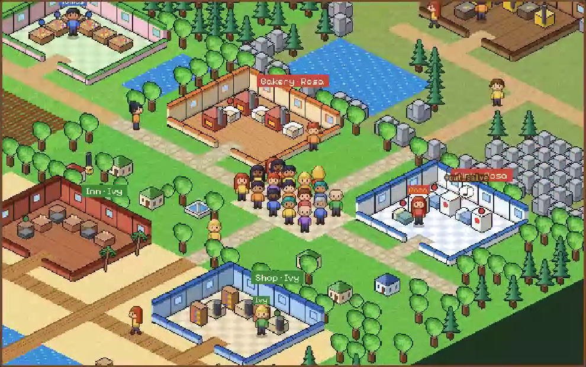
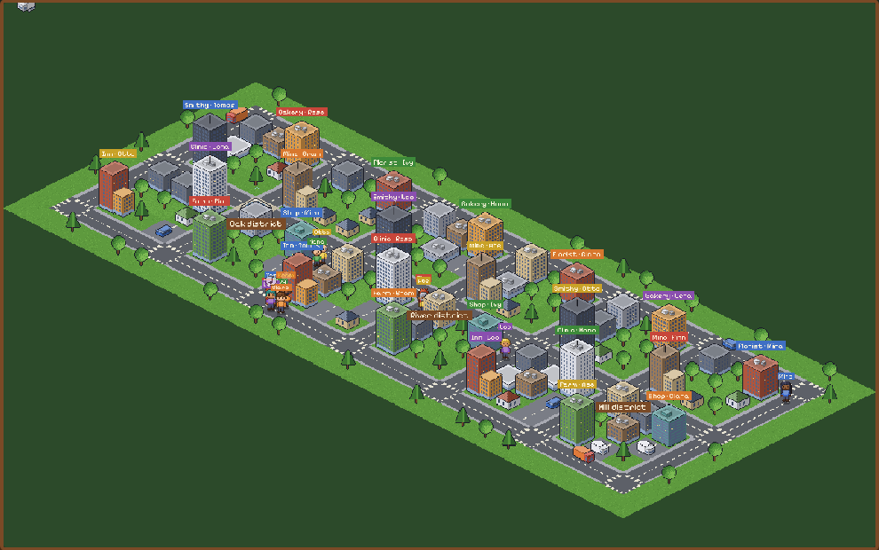

# CodeWorld: networks of developer agents in a world too big for one mind

[English] · [中文 below](#中文)

## Why

The goal is an agent *network* whose collective knowledge exceeds what any single agent can hold, as a
foundation for many agents developing in parallel and across domains. Current multi-agent benchmarks do
not test that. Their tasks fit in one agent's context (with equal compute, a single agent matches or beats
the team: [Tran & Kiela 2026](https://arxiv.org/abs/2604.02460)), their knowledge is given rather than
learned ([EntCollabBench](https://arxiv.org/abs/2605.08761), [MultiAgentBench](https://arxiv.org/abs/2503.01935)),
their coordination tasks are unrelated to knowledge ([AgentsNet](https://arxiv.org/abs/2507.08616)), and
shared-memory studies have no ground truth to score memory against
([Governed Shared Memory](https://arxiv.org/abs/2606.24535)). CodeWorld is built so that

1. the world holds more knowledge than one agent can keep in mind,
2. that knowledge has to be learned by experiment,
3. useful work (a project) needs knowledge from several domains at once,
4. everything is scored exactly: every believed law, every program, every message.

The claim it can test: **a network beats one agent with the same compute exactly when the world is too big
for one agent, and only if the network knows who knows what.**

## The world

A universe is a software ecosystem (`worldseeds/codeworld/world.py`):

* **Modules** (auth, billing, geo, ...) expose **functions** with public signatures
  (`billing.quote_price: Order -> Price`) and hidden behaviour, a **law** on integers mod 101: `a*x + b`, or
  a different `a2*x + b2` on an edge case (`x` a multiple of 2, 3 or 5). Popular modules are used more (a
  long tail).
* Types sit on levels; every function goes one level up, so a **program** from type S to type G is a chain
  of known length. Many chains type-check (often 60–700), usually through functions of different modules.
* A **project** is a feature request: input type, output type and a few examples chosen so that exactly one
  program (up to programs computing the same thing) fits them. Its answer crosses about 3 modules.

## Developers and organisations

A developer (`org.py`) has a **notebook** of limited capacity (laws it can keep in mind; least recently used
are forgotten) and an action budget per sprint. To find out what a function does it can study it
(8 actions: probe inputs 0..7, which pins any law), or ask a teammate (1 action each; the teammate explains
the law, which the asker keeps for the current project only). It searches programs cheapest first, running
them on the examples, and submits the one that fits.

| organisation | who | how knowledge moves |
|---|---|---|
| `solo` | one developer with the **whole team's budget** | it studies everything itself |
| `solo_unbounded` | the same with unlimited memory | upper bound for one head |
| `independent` | n developers on their own projects | never talk |
| `owners` | n developers; every module has an owner (CODEOWNERS) | ask the owner, who learns its own module and keeps it |
| `directory` | n developers and a live registry of who knows what | ask someone who knows (else the owner) |
| `random` | n developers, no idea who knows what | ask up to two random teammates, then study yourself |
| `pooled` | n developers, one shared notebook of n × capacity, no message cost | upper bound for sharing |

LLM developers (`llm_agent.py`) get the same world through tools: `signatures`, `run`, `study`, `remember`
(write a law, scored against the truth), `notebook`, `compute` (run a program with known laws, free),
`ask`, `who_knows`, `submit`. Teammates answer from their notebooks.

## First results (heuristic developers, CPU)

Share of projects done in steady state (sprints 5–8, universes 1 and 2, teams of 4, 120 actions per
developer per sprint; solo gets 480):

| functions | capacity | regime | solo | solo, unlimited memory | independent | random | owners | directory | pooled |
|---|---|---|---|---|---|---|---|---|---|
| 16 | 16 | fits one head | 1.00 | 1.00 | 1.00 | 1.00 | 1.00 | 1.00 | 1.00 |
| 32 | 8 | fits the team | 0.40 | 1.00 | 0.42 | 0.53 | 1.00 | 1.00 | 1.00 |
| 64 | 16 | fits the team | 0.32 | 1.00 | 0.27 | 0.27 | 0.96 | 0.96 | 1.00 |
| 64 | 8 | too big | 0.20 | 1.00 | 0.19 | 0.20 | 0.31 | 0.27 | 0.59 |
| 128 | 16 | too big | 0.13 | 1.00 | 0.15 | 0.14 | 0.16 | 0.16 | 0.42 |

Growing the team in the biggest world (128 functions, capacity 16):

| team | solo (same compute) | random | owners | directory | pooled |
|---|---|---|---|---|---|
| 2 | 0.33 | 0.19 | 0.16 | 0.16 | 0.31 |
| 4 | 0.13 | 0.14 | 0.16 | 0.16 | 0.42 |
| 8 | 0.07 | 0.11 | 0.45 | 0.45 | 1.00 |
| 16 | 0.05 | 0.11 | 0.43 | 0.44 | 1.00 |

What it shows:

* **Three regimes.** When the world fits one head, organisation does not matter. When it is too big for
  one head but fits the team's heads together, a network with routing (owners, directory) does as well as
  perfect sharing (0.96–1.00) and three times better than one developer with the same compute (0.32–0.40),
  who keeps forgetting and re-learning (≈ 320 laws re-learned per sprint). When it is too big even for the
  team, everyone fails.
* **Routing is the network.** The same team asking at random does no better than working alone (0.27 at 64
  functions): a network without "who knows what" is not a network.
* **The coordination tax.** In the biggest world, 8 developers with owners finish 0.45 against 0.07 for one
  developer with their compute, but pooled memory finishes everything: the gap is the cost of asking (one
  question per foreign function per project). What to communicate, and when to delegate a sub-problem
  instead of asking for facts, is the open question for agent networks that this world measures.

## The town: CodeWorld you can watch

The same world, told as a town (`--theme town`, `worldseeds/codeworld/townmap.py`): modules are
**workshops** with **machines** (functions such as `bakery.spin_herb: wheat -> herb`), types are goods, a
project is an **order**, a developer is an **apprentice**, and the owner of a module is its **master**.

**Maps.** Like a farming game, the town is several maps joined at their edges. Every district has four:
the **town** (bakery, clinic) in the middle, the **farm** (farm, florist) to the west, the **mountain**
(mine, smithy) to the north and the **beach** (inn, shop) to the south; the town's east road leads to the
next district's farm. The maps touch at their exits, so zoomed out they are one landscape (woods between
them, the sea along the beaches) with the roads running on from map to map. Each map is 22 x 14 tiles of paths, fields, water, rocks and trees; each workshop is a
room of 6 x 5 tiles, entered by one door, with its machines along the walls. In the town, a master keeps
the two workshops of one map.

* **Walking.** Apprentices walk tile by tile along the shortest route, from map to map through the exits,
  and remember each route they have walked. With `--walk`, studying a machine or asking someone means going
  there, one action per 16 tiles of the route (about 2 inside a map, 3 to a neighbouring map, 5–10 to another
  district). The route of every walk is in the replay, so the client draws the very path that was charged.
* **`--batch`.** One visit to a master explains every machine of theirs that the order may need, not just
  the one asked about.

The standard town is 8 workshops x 6 machines (48 rules) on four maps, apprentices who keep 12 rules in
mind, teams of 4 (the world fits the team but not one head). Share of orders delivered in steady state
(town: sprints 5–8, universes 1–3; three districts: sprints 7–10, universes 1–2):

| world | questions | solo (same compute) | random | owners | directory | pooled |
|---|---|---|---|---|---|---|
| town, 48 machines, team of 4 | per machine | 0.46 | 0.50 | 1.00 | 1.00 | 1.00 |
| town, walking | per machine | 0.32 | 0.35 | 1.00 | 1.00 | 1.00 |
| 3 districts (12 maps), 144 machines, team of 12 | per machine | 0.02 | 0.09 | 0.39 | 0.39 | 1.00 |
| 3 districts, walking | per machine | 0.01 | 0.02 | 0.12 | 0.14 | 1.00 |
| 3 districts | one visit | 0.02 | 0.14 | 1.00 | 1.00 | 1.00 |
| 3 districts, walking | one visit | 0.01 | 0.03 | 1.00 | 0.97 | 1.00 |

At town scale the network already doubles what one apprentice does with the same time (three times once
questions cost a walk). With three districts, one head is hopeless (1–2%), a routed network that asks one
machine at a time pays a heavy coordination tax (39%, 12–14% once questions cost a walk), and asking for
everything a master knows that the order might need removes it (97–100%). What and how much to say per
message is a first-class variable.

**Town buildings and events (each a switch, off by default).** `--board`: a notice board on each plaza
lists who knows which rule; without routing (`random`) apprentices read it once a sprint and ask the right
person. `--library`: masters write their machines down at the library, anyone can read them there.
`--post`: ask by letter (no walk; the answer takes `--post-delay` actions). `--shortcuts`: forest trails
from each farm to its mountain and beach. Seeded random events (`events.py`, the same for every
organisation): `--breakdown` (a machine out of order for 1–2 sprints), `--drift` (a machine re-tuned: its
rule changes; whoever learned the old one holds a wrong rule), `--festival` (one finished good four times
as wanted), `--storm` (walking across an outdoor map costs double), `--rumor` (posts on the board, true or
false). A master notices what happens to its own machines and posts it; others find out by walking to a
broken machine, by an order that will not fit (they then doubt what they remember and look again) or from
the board. First numbers (town, 4 apprentices, walking, one-visit questions, sprints 5–8, universes 1–3):
with breakdown and drift rates of 0, 0.03 and 0.08 per machine per sprint, a team without masters
(`random`) delivers 0.63, 0.48 and 0.34 of its orders, a team of masters 1.00, 1.00 and 0.98.

**Grand goals** (`goals.py`, `--goals banquet prize recipe encyclopedia --goal-deadline N`): what the whole
town works towards, before the day's orders, each with a deadline and exactly scored parts.

| goal | in the town | kind of problem |
|---|---|---|
| `banquet` | the harvest festival: a feast, hampers, a wagon for the parade, an elixir for the toast, each a four-machine recipe across three or more workshops, given by remembered grades | assembly (like editing a molecule towards target properties) |
| `prize` | the judges' prize: a finished good of exactly a given grade from a given raw good; any recipe, any batch, so one must know a recipe's rules well enough to run it backwards | inverse problem (a maths problem) |
| `recipe` | old Martha's lost recipe: only batch and result grades survive, not the raw good or the machines | decoding (breaking a code) |
| `encyclopedia` | every machine's rule written correctly at the library, and kept right as machines get re-tuned | building shared knowledge (the network itself) |

If re-tuned machines make an open part impossible, the town re-issues it with the grades the machines make
now. Three districts (144 machines, 12 apprentices, 12 rules per head), breakdowns and re-tuning at 0.03 per
machine per sprint, festival + prize + lost recipe due by sprint 4 (universes 1 and 2): one apprentice with
the whole team's time finishes no goal (1 of 16 parts); a team asking at random finishes 1–2 goals (the prize;
7 of 16 parts); masters or a roster finish all three (16 of 16). With the encyclopedia as well, the library
becomes a shared memory without a capacity limit: everyone does better once it is written, but only masters
keep it right as machines change (92% of the entries correct after eight sprints, against 81–83%).

**Money** (`economy.py`, `--money`): everyone has a purse and the town a treasury. Customers pay for
orders: half to whoever delivered, a royalty to the masters whose machines were used, the rest as tax. The
treasury pays bounties for goal parts. Money buys overtime for goal work (more actions), wages (an idle
teammate makes your order), and, with `--answer-price`, explanations; `--upkeep` makes food and lodging cost
coins (paid to the bakery, inn, farm and shop masters; who cannot pay is tired, with a quarter less time). The
clock tower (`--goals fund`) is a goal paid in money: the treasury must hold `--fund` coins by the deadline,
from taxes and from gifts, and each apprentice has its own generosity (0 to 80% of what it can spare), so
free riders appear. Town, 4 apprentices, festival + prize + clock tower (400 coins) by sprint 4, upkeep 10,
universes 1–3: with explanations free, at 3 and at 8 coins, masters still deliver 99–100% of orders and all
goals, but inequality grows (Gini 0.21, 0.33, 0.39); a team without masters finishes 6 of 9 goals. Rule-based
apprentices always pay when they can: whether agents hoard knowledge, raise prices or collude is a question
for LLM apprentices.

**LLM apprentices in the town** (`town_llm.py`; `--policy llm --theme town`, or
`scripts/build_codeworld_web.py --llm` for replays to watch): each apprentice is an LLM agent with the
developer tools (study, remember, compute, ask, submit) plus the town's: `town`, `goals`, `deliver_goal`,
`set_price`, `pay`, `buy_overtime`, `hand_over`, `letter`, `post`, `board`, `library_read`, `library_write`.
Studying a machine means walking to its workshop, asking someone means walking to them. Its score is coins +
5 × reputation, scaled by how the town's goals went (0.5 if all fail, 1 if all succeed), so nobody wins by
getting rich while the town fails. Rules against gaming the town, enforced by the engine and logged as
`exploits`: money is only made by customers (transfers move it, never create it); a goal part takes at
most 3 deliveries and a wrong one costs 5 coins and 2 reputation (no brute force on the prize's grades);
reputation for an explanation counts once per asker, machine and sprint and only if the rule was right;
prices for explanations are capped; one cannot pay, ask or hire oneself. `scripts/mock_llm_server.py` is an
OpenAI-compatible stand-in for dry runs without a GPU; `slurm/town_llm_job.sh` runs replays and the
experiment (masters, roster, no masters, one apprentice; free and paid answers) on Nibi with vLLM.

**Watching it.** `web/codeworld.html` (SeedVille Workshops) plays back sprints recorded by the engine, so
the picture is exactly what happened: the maps drawn as small isometric scenes, workshops as rooms without
a roof where you see apprentices step up to the machine they study, a light over every machine whose rule
someone keeps in mind (in that person's colour), questions drawn between asker and master, each walk's
route, the customer of every order queueing at the plaza and leaving once served, townsfolk strolling the
paths, and the camera following the action from map to map (or any map, or all of them, by hand).

```bash
python scripts/build_codeworld_web.py      # writes web/replays/codeworld.json (7 recorded runs)
python -m http.server -d web 8000          # open http://localhost:8000/codeworld.html
python web/tools/kairoart.py               # (re)draws the map sprites, web/assets/kairo.png
```





## Running

```bash
python scripts/run_codeworld.py --out results/codeworld/core                 # heuristic, ~10 s
python scripts/run_codeworld.py --modules 32 --capacities 16 --team-sizes 2 4 8 16 --out results/codeworld/scale
python scripts/analyze_codeworld.py results/codeworld/core --costs
# the town (8 workshops x 6 machines) and three districts, walking, one-visit questions
python scripts/run_codeworld.py --theme town --walk --modules 8 --fns-per-module 6 --capacities 12 --team-sizes 4 --out results/codeworld/town
python scripts/run_codeworld.py --theme town --walk --batch --modules 24 --fns-per-module 6 --capacities 12 --team-sizes 12 \
    --projects-per-dev 3 --out results/codeworld/districts
# LLM developers (any OpenAI-compatible server)
WS_BASE_URL=http://localhost:8000/v1 WS_MODEL=qwen3-8b python scripts/run_codeworld.py --policy llm \
    --modules 8 --capacities 8 --team-sizes 4 --sprints 2 --projects-per-dev 2 --budget 100 --save-traces --out results/cw_llm
# Nibi
PILOT=1 bash slurm/submit_codeworld.sh && bash slurm/submit_codeworld.sh && sbatch slurm/codeworld_cpu.sh
```

## Next

* **Delegation**: ask an owner to solve a sub-chain ("from Order to Price, fitting these values") instead
  of asking for laws: fewer, richer messages; it tests whether agents can split work, not just share facts.
* **Teaching**: an explanation that lands in the asker's notebook (costs capacity) vs working memory only.
* **Specialists that drift**: modules change between releases (laws shift), owners leave, wrong
  explanations (correlated faulty owners) — the hive's provenance, audits and regional memory carry over.
* **Heterogeneous agents**: different models and capacities in one network; routing by competence.
* **Bigger and deeper worlds**: functions of two arguments, side effects (state), and modules whose
  behaviour depends on configuration from other modules (cross-domain dependencies beyond the type graph).

---

## 中文

**为什么做这个。** 目标是建一个 agent 网络：整体知识量超过任何单个 agent 能装下的量，为以后多 agent 并行、跨领域开发打基础。现有多 agent 基准测不了这件事：任务一个 agent 就装得下（等算力下单 agent 持平甚至更好），知识是给定的而不是学来的，协调任务和知识本身无关，共享记忆研究没有标准答案。CodeWorld 的设计保证四点：世界的知识量超过单个 agent 的容量；知识要靠实验学；项目必须同时用到多个模块（领域）的知识；所有东西都能精确打分。它要检验的命题是：**只有当世界大到一个 agent 装不下时，网络才会胜过等算力的单 agent，而且前提是网络知道"谁知道什么"。**

**世界。** 一个软件生态：模块（auth、billing、geo……）暴露函数，签名公开，行为隐藏（模 101 的 `a*x+b`，或在边界情况下换成另一组系数）。类型分层，每个函数升一层，所以程序是一条长度已知的函数链；能通过类型检查的链常有几十到几百条，通常跨多个模块。项目是功能需求：输入类型、输出类型和几个例子，例子保证只有一个程序（或与它等价的程序）符合。

**开发者与组织。** 每个开发者有容量有限的笔记本（记得住的规律数，最久没用的先忘）和每个冲刺的行动预算。研究一个函数要 8 个行动；问同事双方各花 1 个行动，同事讲解规律，讲解只在当前项目里有效。组织方式：单人（拿全队的预算）、单人无限记忆、各干各的、按模块负责人提问（owners）、目录（知道谁会什么）、随机问、共享笔记本（上限）。LLM 开发者通过工具使用同一个世界，写下的规律逐条对照真值打分。

**初步结果（规则开发者，CPU）：** 见上面两张表。三种情况：世界装得进一个人的脑子时，组织方式无所谓；装不进一个人、但装得进全队时，有路由的网络（owners、directory）达到 0.96–1.00，和完美共享一样，是等算力单人（0.32–0.40）的约三倍；随机提问的团队和单干一样差，没有"谁知道什么"的网络不算网络；世界大到全队都装不下时，所有人都失败。最大世界里 8 个人的网络完成 0.45，单人 0.07，共享记忆 1.00，中间的差距就是"沟通税"：该传什么、什么时候直接委派子问题而不是问事实，这正是 agent 网络要研究的问题。

**小镇：看得见的 CodeWorld。** 同一个世界换成小镇的说法（`--theme town`）：模块是工坊，函数是工坊里的机器，类型是货物，项目是订单，开发者是学徒，模块负责人是师傅。小镇像星露谷一样由多张相连的地图组成：每个街区有四张——中间的小镇（面包房、诊所）、西边的农场（农场、花店）、北边的山区（矿场、铁匠铺）、南边的海滩（旅店、商店）；小镇东边的路通往下一个街区的农场。地图在出口处相接，缩小后是一整片连续的地形（地图之间是树林，海滩外是海），道路从一张地图延伸到下一张。每张地图 22×14 格，工坊是 6×5 格、只有一扇门的房间，机器靠墙摆放；每个师傅负责同一张地图上的两个工坊。学徒沿最短路线一格一格走，穿过地图出口进入下一张地图，走过的路会记住。`--walk`：研究机器或问人都要走过去，路线上每 16 格花 1 个行动（同一张地图内约 2，相邻地图 3，跨街区 5–10）；`--batch`：去一次师傅那里，师傅把订单可能用到的他的所有机器都讲了。

结果（稳定期完成率）：标准小镇（4 张地图、48 台机器、每人记 12 条、4 个学徒）单人（等算力）0.46，要走路时 0.32；有路由的网络 1.00。三个街区（12 张地图、144 台机器、12 人）：单人 0.01–0.02；一次只问一台机器的网络 0.39，要走路时只剩 0.12–0.14（沟通税）；一次问全的网络 0.97–1.00。每条消息说什么、说多少，是 agent 网络的核心变量。

**建筑与事件（都是开关，默认关闭）。** 公告板（谁懂什么）、图书馆（师傅把规律写下来，任何人都能去读）、邮局（写信提问，不用走路但要等回信）、林间近路。随机事件由种子决定，每种组织遇到的完全一样：机器故障、规律漂移（机器被重新调校，记着旧规律的人就记错了）、节日（某种成品需求翻四倍）、暴风雨（户外地图走路成本翻倍）、谣言（公告板上真假难辨的消息）。师傅能察觉自己机器的变化并贴出告示；其他人要么走过去发现故障，要么订单怎么都对不上时开始怀疑自己记的规律、重新查看。故障和漂移率为 0、0.03、0.08 时，没有师傅的团队完成率 0.63、0.48、0.34，师傅团队 1.00、1.00、0.98。

**终极目标**（`--goals banquet prize recipe encyclopedia`）：全镇在日常订单之前共同追求的目标，各有截止冲刺和可精确打分的子任务。丰收节（盛宴、礼篮、游行马车、祝酒灵药，每样都是跨三个以上工坊的四步配方，对应"分子编辑"式的组装问题）；评审大奖（指定原料做出恰好某个等级的成品，配方和批次自选，必须把一条配方的规律弄清到能反推，对应数学题式的逆问题）；失传配方（只剩批次与成品的等级记录，原料和机器都不知道，对应破译）；全镇百科（把每台机器的规律正确地写进图书馆，并在机器被重新调校后保持正确，对应建立共享知识网络）。若机器被调校导致某个子任务无解，镇上会按现在的机器重新发布它。三个街区（144 台机器、12 人、每人记 12 条）、故障与漂移各 0.03、丰收节+大奖+失传配方在第 4 冲刺前完成：单人（全队时间）一个目标也没完成（16 个子任务完成 1 个）；随机提问的团队完成 1–2 个（主要是大奖，16 个完成 7 个）；师傅制或名册三个全部完成。加上百科后，图书馆成了没有容量上限的共享记忆，所有人都受益，但只有师傅制能在机器变化时保持它正确（八个冲刺后 92% 正确，其他 81–83%）。

**钱**（`--money`）：每人有钱包，镇上有金库。顾客为订单付钱：一半给交货的人，一部分作为使用费给机器被用到的师傅，其余作为税进金库；金库为终极目标的子任务发悬赏。钱可以买加班（更多行动点）、雇空闲的人做你的订单，开启 `--answer-price` 后提问要付钱；`--upkeep` 是每冲刺的食宿费（付给面包房、旅店、农场、商店的师傅，付不起的人会累，少四分之一的时间）。钟楼（`--goals fund`）是用钱完成的目标：金库要在截止前攒够钱，来源是税和捐款；每个学徒的慷慨程度不同（愿意捐出闲钱的 0–80%），于是出现搭便车的人。单街区、4 人、丰收节+大奖+钟楼（400）在第 4 冲刺前完成、食宿费 10：提问免费、3 和 8 个金币时，师傅团队订单仍完成 99–100%、目标全部完成，但贫富差距变大（基尼 0.21、0.33、0.39）；没有师傅的团队 9 个目标完成 6 个。规则学徒只要付得起就会付钱；agent 会不会囤积知识、抬价或串通，要等换成 LLM 学徒才能看到。

**LLM 学徒**（`--policy llm --theme town`，或 `scripts/build_codeworld_web.py --llm` 生成可观看的回放）：每个学徒是一个 LLM agent，除了研究、记录、计算、提问、交货，还有小镇工具：查看小镇、查看目标、交付目标、定价、付钱、买加班、转交订单、写信、在公告板发帖、读公告板、读写图书馆。研究机器要走到工坊，问人要走到对方那里。个人分数 = 金币 + 5 × 声望，再乘以小镇目标的完成度（全失败 0.5，全成功 1），所以不能靠自己发财、让小镇失败来取胜。防钻空子的规则由引擎强制并记录为 `exploits`：钱只能由顾客带入，转账只移动不创造；每个目标子任务最多交付 3 次，交错扣 5 金币和 2 声望（不能暴力猜大奖的等级）；回答问题的声望每个冲刺对同一提问者、同一机器只算一次，且规律必须正确；定价有上限；不能付钱给自己、问自己、雇自己。`scripts/mock_llm_server.py` 是一个兼容 OpenAI 接口的假服务器，用来在没有 GPU 时试跑；`slurm/town_llm_job.sh` 在 Nibi 上用 vLLM 跑回放和实验（师傅制、名册、无师傅、单人；提问免费与收费）。

**界面。** `web/codeworld.html`（SeedVille Workshops）回放引擎记录下来的冲刺：每张地图是一个小小的等距场景，工坊是掀掉屋顶的房间，能看到学徒走到要研究的机器前；有人记得规律的机器上方会亮灯（灯的颜色是那个人的颜色）；提问有连线，每次行走会画出路线；每张订单有一位顾客在广场排队、完成后离开，镇民在路上走动；镜头跟着正在行动的学徒在地图之间切换，也可以手动选任意一张地图或看全部。运行 `python scripts/build_codeworld_web.py` 生成回放，再 `python -m http.server -d web 8000` 打开 `codeworld.html`；`python web/tools/kairoart.py` 重新绘制地图素材。

**下一步：** 委派子问题、把讲解写进笔记本的"教学"、会漂移的专家（版本更新、负责人离开、讲解出错）、异构 agent、两个参数的函数、带状态的函数、跨模块的配置依赖。
